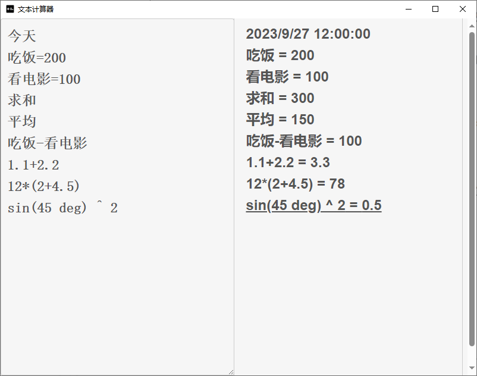

# 文本计算器

一个简单的文本计算器，支持在线和主流桌面平台，文件体积仅5MB。



## 使用

在线：https://tauri-note-cal.pages.dev/

下载：https://github.com/CrankZ/tauri-note-cal/releases

## 功能

- 日期计算

- 数学计算

- 支持变量

- 支持求和、平均

## 开发

安装

```
pnpm install
```

运行

```
pnpm tauri dev
```

编译

```
pnpm tauri build
```

## 技术栈

[Tauri](https://github.com/tauri-apps/tauri)

[React](https://github.com/facebook/react)

[Math.js](https://github.com/josdejong/mathjs)

[Chrono](https://github.com/wanasit/chrono)

[Icons8](https://icons8.com/)